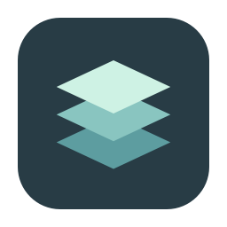

<p align="center">
  
</p>

# CodexM

在 macOS 菜单栏管理多个 Codex 账户，让项目在账户之间继续。

为不同账户保留独立登录状态，从菜单栏切换窗口，并通过项目接力继续已有任务。

**当前版本：1.0.0 · macOS 14+ · Apple Silicon / Intel**

CodexM 是独立开发的开源工具，与 OpenAI 无隶属或背书关系，不包含官方客户端。

## Install

需要先安装兼容的官方客户端。CodexM 按应用标识 `com.openai.codex` 识别客户端，部分版本在系统中显示为 ChatGPT。

从 [GitHub Release 下载 DMG](https://github.com/5hux1n/CodexM/releases/latest)，打开后将 CodexM 拖入 Applications，再从“应用程序”启动。

也可以使用 Xcode 26+ 和 Python 3 从源码构建：

```sh
git clone https://github.com/5hux1n/CodexM.git
cd CodexM
export DEVELOPER_DIR=/Applications/Xcode.app/Contents/Developer
./scripts/build_release.sh
open dist/CodexM.app
```

如果 Xcode 安装在其他位置，请修改 `DEVELOPER_DIR`。构建会生成 `dist/CodexM.app`、`dist/CodexM-v1.0.0-macOS.dmg` 和 ZIP 压缩包。将应用放到固定位置后使用。

当前发布包及本地构建采用 ad-hoc 签名，未经 Developer ID 签名或 Apple 公证。替换应用后，macOS 可能要求重新授予辅助功能权限。

## Quickstart

1. 打开 CodexM，在“通用设置”中确认或选择已安装的官方客户端。
2. 在“我的账户”中添加账户，点击启动，在官方客户端内完成登录。
3. 点击菜单栏 CodexM 图标查看账户。悬停右侧箭头展开操作菜单，移走关闭，点击箭头固定展开。
4. 选择窗口切换到对应任务。需要精确聚焦、新建窗口或悬停预览时，按应用提示授予辅助功能权限。
5. 需要换账户继续任务时，打开“项目接力”，选择来源任务、目标账户和接力方式。

默认退出 CodexM 后，已运行的客户端继续运行；可以在设置中更改这一行为。

## 账户与窗口

- **独立登录:** 新增账户分别使用独立的 `CODEX_HOME` 和 Electron 用户数据目录。默认账户沿用本机已有数据。
- **集中管理:** 启动、停止、重启账户，查看窗口数量，重命名账户配置。
- **窗口预览:** 在子菜单中悬停窗口项进行预览，并通过呼吸边框识别目标窗口；点击切换。
- **本机体验:** 支持简体中文、English、系统外观和登录 Mac 时启动。

账户隔离属于应用数据目录隔离，不是虚拟机隔离。删除新增账户会将其数据移入废纸篓；运行中或被占用的账户不能删除，默认账户不能删除。

## 两种项目接力

| 方式 | 适合的用途 | 使用流程 |
| --- | --- | --- |
| 上下文接力 | 用整理后的上下文继续任务 | 读取所选任务，预览接力内容，生成接力包，在目标客户端手动粘贴并发送继续指令 |
| 原生任务迁移 | 将已有任务历史导入目标账户 | 暂停来源任务，停止目标客户端，通过占用与兼容性检查后执行导入 |

原生迁移包含备份、导入验证和回滚，会写入目标任务存储，并依赖官方客户端的本地加载器。官方版本更新可能改变兼容性；检查失败时请保留诊断信息。目标数据发生变化后，回滚也可能被拒绝，以免覆盖后续工作。

上下文接力会做基础脱敏，但不能识别所有敏感内容。发送前请检查生成结果。

## 数据与使用边界

账户配置与新增账户数据默认位于 `~/Library/Application Support/CodexM/`。可以在设置中更改新增账户的数据目录；默认账户仍使用官方客户端原有位置。

CodexM 不提供账户服务器、遥测或凭据同步。登录由官方客户端完成，认证状态检测仅读取认证文件元数据，不解析认证文件内容。官方客户端自身的网络行为由其控制。

多窗口、跨桌面聚焦及原生迁移仍需在你的客户端版本下验证。遇到问题，请在 [Issues](https://github.com/5hux1n/CodexM/issues) 中附上 macOS、CodexM、官方客户端版本和复现步骤；不要上传认证文件或完整私人会话。

源码构建与维护说明见 [开发文档](docs/DEVELOPMENT.md)。

## License

采用 [MIT License](LICENSE)。图标资源的第三方许可见 [GitHub Octicons](CodexM/Resources/GitHub-Octicons-LICENSE.txt)。
